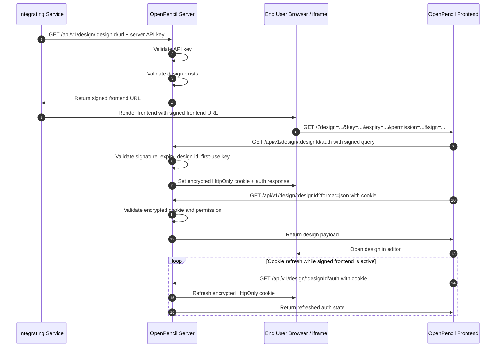

# @open-pencil/server

Headless prompt-to-design backend. No browser, no MCP, no ACP/Claude-Code-style agents —
just `@open-pencil/core` driven directly by a forked copy of the in-app chat's tool-loop,
running server-side.

## Where this goes in your fork

Everything under this directory is **new** — it doesn't overwrite any upstream file. Drop
the whole `packages/server/` folder into your fork at the repo root, next to the existing
`packages/core`, `packages/cli`, `packages/mcp`, etc.:

```
open-pencil/                        ← your fork root
├── packages/
│   ├── core/                       ← unchanged, upstream
│   ├── cli/                        ← unchanged, upstream
│   ├── mcp/                        ← unchanged, upstream (not used by this backend)
│   ├── scene-graph/ kiwi/ fig/ ... ← unchanged, upstream
│   └── server/                     ← ★ everything in this bundle goes here
│       ├── package.json
│       ├── tsconfig.json
│       ├── .env.example
│       ├── README.md               (this file)
│       └── src/
│           ├── index.ts            HTTP app bootstrap (Hono)
│           ├── env.ts              env var loading/validation
│           ├── document.ts         blank/load/save a SceneGraph — headless, no store
│           ├── model.ts            adapted from src/app/ai/chat/model.ts
│           ├── headless-tools.ts   adapted from src/app/ai/tools/index.ts
│           ├── chat-engine.ts      adapted from src/app/ai/chat/transports.ts
│           ├── session-manager.ts  in-memory session map, keyed by design UUID
│           ├── system-prompt.md    ★ copy this file manually — see below
│           ├── storage/
│           │   ├── s3.ts           S3-compatible object storage (bytes)
│           │   └── metadata.ts     Postgres metadata (prompt history, timestamps)
│           ├── db/
│           │   └── schema.sql      `designs` table
│           └── routes/
│               ├── generate.ts     POST /generate
│               ├── save.ts         POST /designs/:uuid/save
│               └── get.ts          GET  /designs/:uuid
└── src/                            ← unchanged, upstream web app (fork this separately —
                                       see "Client-side loader" below — not included in
                                       this bundle)
```

## One manual step: copy the system prompt

`chat-engine.ts` expects `src/system-prompt.md` to exist next to it. That file is the
actual prompt the in-app chat uses — copy it verbatim from the upstream source you already
have in your fork:

```sh
cp src/app/ai/chat/system-prompt.md packages/server/src/system-prompt.md
```

It's not duplicated in this bundle on purpose — you already have the real, current version
in your checkout, and copying from there guarantees it matches whatever version of
OpenPencil you forked (upstream updates this file regularly per the CHANGELOG).

## Setup

### Option A — Docker Compose (Postgres + MinIO + server, one command)

`docker-compose.yml` and `.env.docker.example` live at the **repo root**, one level up
from this package (next to `package.json`/`bun.lock` if you kept the monorepo layout).

```sh
# from the repo root, not packages/server
cp src/app/ai/chat/system-prompt.md packages/server/src/system-prompt.md
cp .env.docker.example .env
# edit .env: fill in AI_API_KEY — everything else already matches the compose services
docker compose up -d
docker compose logs -f server
```

This brings up Postgres (with the `designs` table auto-created on first boot), MinIO
(with the bucket auto-created by the one-shot `minio-init` job), and the server itself,
listening on `http://localhost:8787`. MinIO's web console is at `http://localhost:9001`
(login with the `S3_ACCESS_KEY_ID`/`S3_SECRET_ACCESS_KEY` from your `.env`) if you want to
poke at saved `.fig` files directly.

To run only the infra in Docker and the server on your host instead (e.g. for `tsx watch`
hot-reload during development), comment out the `server:` service in `docker-compose.yml`
and run `npm run dev` from this directory — `.env.docker.example` already has the
`localhost`-based `DATABASE_URL`/`S3_ENDPOINT` values filled in for that case.

### Option B — Manual

```sh
cd packages/server
cp .env.example .env      # fill in your model API key + S3 + Postgres credentials
npm install                # or bun install, if you're keeping this in the bun workspace
cp ../../src/app/ai/chat/system-prompt.md src/system-prompt.md
npm run migrate            # creates the `designs` table
npm run dev                 # http://localhost:8787
```

## API

### Routes

| Route                              | Body / params                                            | What happens                                                                                                                                       |
| ---------------------------------- | -------------------------------------------------------- | -------------------------------------------------------------------------------------------------------------------------------------------------- |
| `GET /api/v1/health`               | —                                                        | Returns a simple health payload.                                                                                                                   |
| `POST /api/v1/generate`            | `{ prompt, designId? }`                                  | Creates a blank session, or resumes/reloads `designId`, runs one agent turn, mutates the in-memory document. Nothing is persisted yet.           |
| `GET /api/v1/generate/status/:id`  | `:id = generation request id`                            | Returns queue position while pending and completion or failure once generation finishes.                                                           |
| `GET /api/v1/generate/status/size` | —                                                        | Returns the current pending generate queue size.                                                                                                   |
| `GET /api/v1/design/:designId/url` | `?permission=read|write`                                 | Validates the design exists and returns a signed frontend display URL.                                                                              |
| `GET /api/v1/design/:designId/auth`| signed query on first load, cookie on later loads        | Validates the signed frontend query, issues or refreshes the encrypted cookie, and returns the effective permission.                                |
| `GET /api/v1/design/:designId`     | `?format=json` optional                                  | Returns raw `.fig` bytes by default or `{ metadata, dataBase64 }` when `?format=json` is set.                                                    |
| `PUT /api/v1/design/:designId`     | raw `.fig` bytes                                          | Saves a browser-edited design back to storage. Requires write permission.                                                                   |
| `POST /api/v1/design/:designId/save` | —                                                      | Serializes the server-side in-memory session document to `.fig` bytes, writes to storage, and upserts metadata in Postgres.                      |

### API Key Protection

Set `SERVER_API_KEY` in the server environment and send either `Authorization: Bearer <key>` or `x-api-key: <key>`.

Protected routes:

- `POST /api/v1/generate`
- `GET /api/v1/generate/status/:id`
- `GET /api/v1/generate/status/size`
- `GET /api/v1/design/:designId/url`

The frontend cookie routes are intentionally not behind `SERVER_API_KEY`. They are authorized by the signed design URL on first access and then by the encrypted cookie on later requests.

### End-User Design Load Flow



Unsaved sessions are dropped automatically after `SESSION_TTL_MINUTES` of inactivity — that's
the "discard if not explicitly saved" behavior from the original spec. Session KV storage is
selected with `KV_PROVIDER` (`memory`, `fs`, or `redis`). `KV_PROVIDER=fs` stores session data
under `STORAGE_DIR/kv`, and `KV_PROVIDER=redis` requires `REDIS_URL`.

## Minimal client SDKs (no external dependencies)

This package includes two tiny client-side SDKs, each implemented as a single class and using
only built-in platform APIs:

- TypeScript: `sdk/typescript/OpenPencilClient.ts`
- Python: `sdk/python/openpencil_client.py`

Both clients are initialized with the server endpoint and expose only:

- `health`
- `generate`
- `getGenerateStatus` / `get_generate_status`
- `getGenerateQueueSize` / `get_generate_queue_size`
- `getDesignBinary` / `get_design_binary`
- `getDesignJson` / `get_design_json`

The design save API (`POST /api/v1/design/:designId/save`) is intentionally not exposed.

## Client-side loader (not included here — separate small change)

The stock web app has no "load a design by UUID from a server" step, since it's designed
to be fully local-first. To open a saved design from this backend in the browser, add a
bootstrap check early in the app's startup (e.g. in `src/main.ts`):

```ts
const params = new URLSearchParams(location.search);
const designId = params.get("designId");
if (designId) {
  const bytes = await fetch(`${SERVER_URL}/designs/${designId}`).then((r) => r.arrayBuffer());
  // hand `bytes` to whatever the app already calls on File > Open — the same
  // io.readDocument() codepath this backend uses in document.ts
}
```

The exact hook point depends on how `src/app/editor/` wires up file-open today — worth
tracing `readDocument`'s other caller (the file-picker handler) to reuse it instead of
duplicating import logic.

## Known gaps to close before production use

These are called out in the accompanying spec doc and still apply here:

1. **Text/font metrics headlessly** — `headless-tools.ts` drops the `ensureGraphFonts(...,
store.renderer)` call from upstream since there's no live renderer. `@open-pencil/core/io`
   does export `initCanvasKit` / `headlessRenderNodes` for headless raster rendering, which
   is a good sign, but verify text layout matches the in-app result before trusting
   typography-heavy prompts.
2. **Multi-instance deployment** — `session-manager.ts` is single-process, in-memory. Fine
   for one server instance; needs sticky routing or a shared store (Redis) if you scale
   horizontally.
3. **Auth scope** — generate routes and signed URL issuance are protected by `SERVER_API_KEY`,
   but frontend design loading itself relies on the signed URL plus encrypted cookie flow. Review
   that split before exposing the service beyond trusted integrations.
4. **Retry/rollback on tool failure** — `onBeforeExecute` in `headless-tools.ts` has a
   placeholder comment for snapshot/restore; upstream uses this for its undo stack, you may
   want it for retrying a failed multi-step generation instead.
